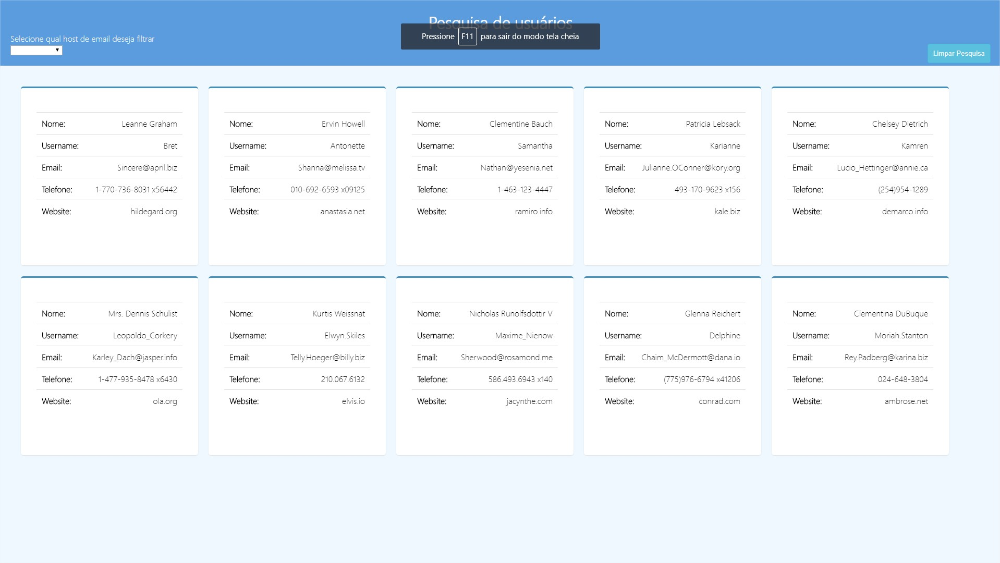

# Front para amostragem de usuários

> Descrição

Front criado para mostrar dados de diferentes usuários provenientes de um json.
As informações são mostradas tanto na parte da frente quanto na de trás de cada card que vira com o passar do mouse.
Um filtro de seleção pode ser utilizado para mostrar somente os usuários que utilizam o host de email desejado.
Também adicionado um botão de limpar pesquisa que te traz novamente a página em sua forma inicial.

## Dados pessoais

Kevin Vinicius Nazaré Lopes – kevinlopes554@gmail.com

[https://github.com/KevinLopes554/github-link](https://github.com/KevinLopes554)